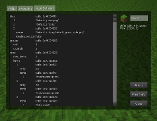
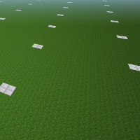

# Shakedown

> shake·down /ˈʃeɪkdaʊn/ (noun): a period of testing undergone before being declared operational.

#### [cubictest](./cubictest/)
###### The behavior driven testing framework for minetest

```lua
describe("my mod's functionality", function()
	it("can calculate 1*1", function()
		Given "two numbers"
		local number, factor = 1, 1
		When "multiplying"
		local result = number * factor
		Then "calculate the right answer"
		assert.is.equal(1, result)
	end)
end)
```
#### [smoketest](./smoketest/)
###### Preliminary tests, that detects simple early failures.
```yaml
Node: default:chest_locked
 - it can be placed against an unknown node and will be removed from the ItemStack
 - it can be punched
 - it handles a null player passed to its can_dig(pos, [player])
!! but fails with:
.../default/nodes.lua:1357: attempt to index local 'player' (a nil value)
[fail (2/3)]
```
#### [sd (shakedown)](./sd/)
###### Utilities for developing, (collaborative) testing and debugging.

#### [testingground](./testingground/)
###### A testing oriented singlenode mapgen.


Make sure to get the submodules too:
```sh
git clone --recurse-submodules https://github.com/t4im/shakedown.git
```

## Related projects
* <a href="https://github.com/t4im/profiler/">profiler</a> — Measure and analyze performance of mods.
* <a href="https://github.com/t4im/coretest/">coretest</a> — cubictest against the minetest api/core.

## License
The following applies to all mods of this modpack unless different conditions are stated in their respective directories:

  This program is free software. It comes without any warranty, to the extent permitted by applicable law.
  You can redistribute it and/or modify it under the terms of the Do What The Fuck You Want To Public License, Version 2, as published by Sam Hocevar.

See [the license file](WTFPL.license) or [the wtfpl website](http://www.wtfpl.net/) for more details.

TL;DR: 'Do what the cobble you want'
