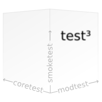

# cubictest
The behavior driven testing framework for minetest.

> cubictest /ˈkjuː.bɪktɛst/ (noun):
>   1. voxel behavior examination
>   2. behavior examination of third degree, order or power

## License

This software is licensed under the MIT License (Expat).
See [the license file](MIT.license) for details.